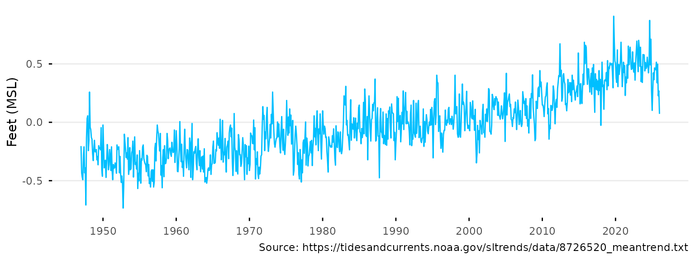
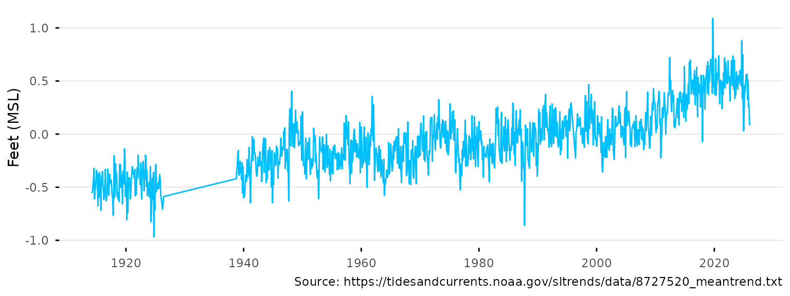
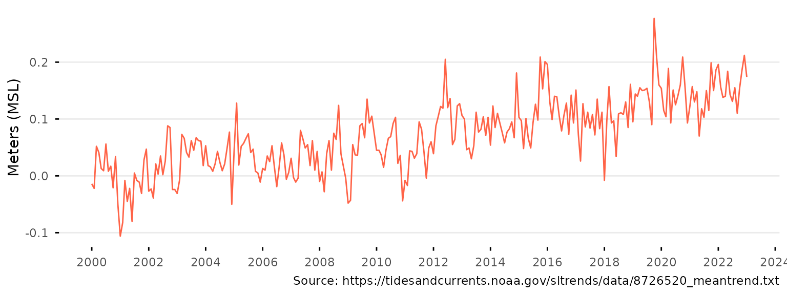
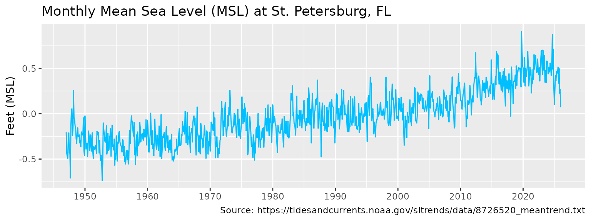
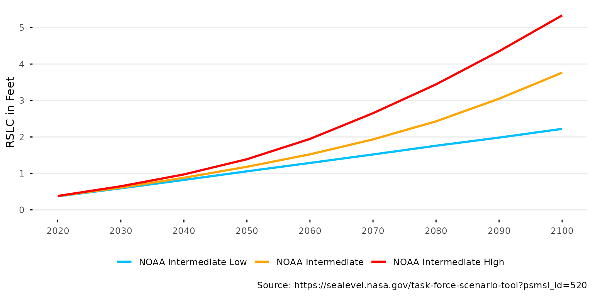
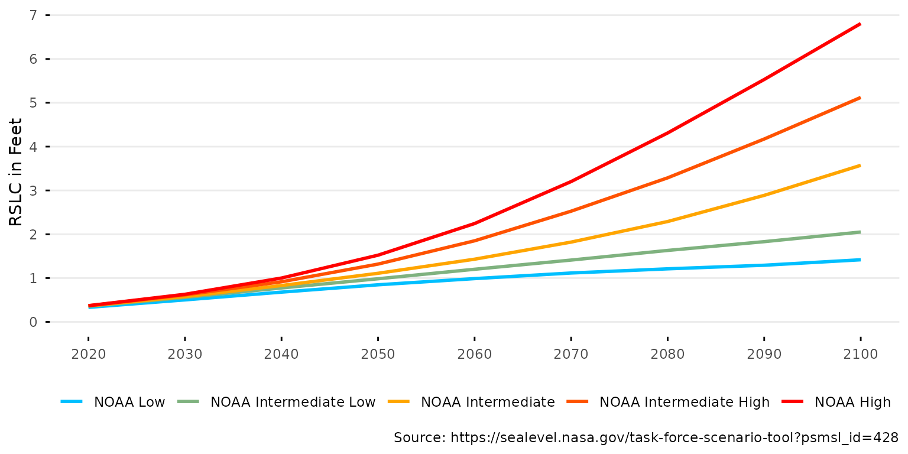
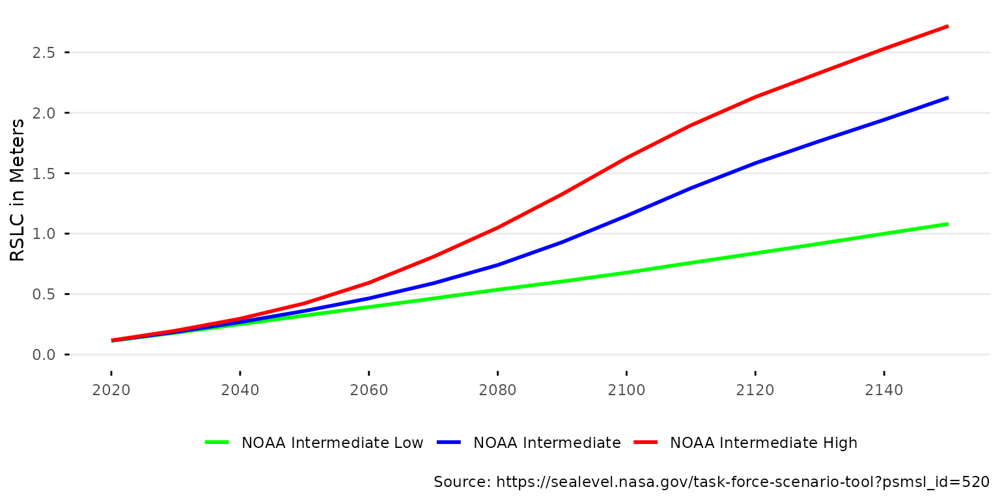
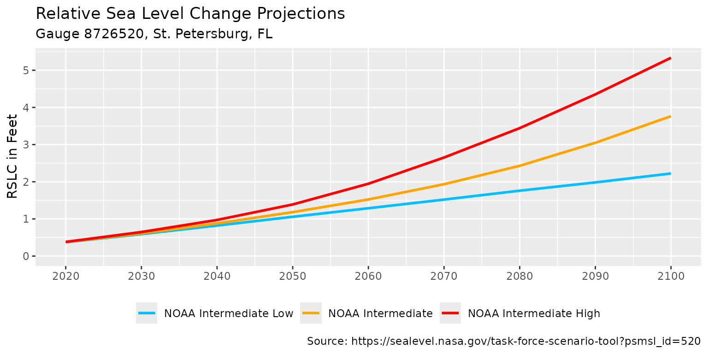

# Getting started

## Installation

Install the package from
[r-universe](http://tbep-tech.r-universe.dev/ui/#builds) as follows. The
source code is available on
[GitHub](https://github.com/tbep-tech/slrcsap).

``` r
# Install slrcsap in R:
install.packages('slrcsap', repos = c('https://tbep-tech.r-universe.dev', 'https://cloud.r-project.org'))
```

Load the package in an R session after installation:

``` r
library(slrcsap)
```

## Usage

The package includes two core workflows to download and plot data
relevant to assess sea level rise risks in the Tampa Bay region. The
first workflow retrieves and plots historical sea level data and the
second retrieves and plots sea level rise scenario data. Default
arguments for all functions are set for the tidal gauge at
[St. Petersburg,
FL](https://tidesandcurrents.noaa.gov/stationhome.html?id=8726520)
following recommendations from the Tampa Bay Climate Science Advisory
Panel \[1\]. The content below demonstrates how to use the functions in
this package for each workflow.

### Sea level Data

Sea level data are downloaded from the [NOAA Tides and
Currents](https://tidesandcurrents.noaa.gov) website. The data are
available for all NOAA tide gauges and is setup to download data for the
St. Petersburg, FL gauge (NOAA ID 8726520) by default. The data is read
directly into R from the URL
<https://tidesandcurrents.noaa.gov/sltrends/data/8726520_meantrend.txt>.
The data for St. Petersburg, includes monthly mean sea level (MSL)
values from 1947 to the present, including a seasonal correction.

``` r
# Download sea level data for St. Petersburg
spsealevel <- get_sealevel()
head(spsealevel)
#>     gauge Year Month       date  msl_m     msl_ft
#> 1 8726520 1947     1 1947-01-01 -0.062 -0.2034121
#> 2 8726520 1947     2 1947-02-01 -0.132 -0.4330709
#> 3 8726520 1947     3 1947-03-01 -0.143 -0.4691601
#> 4 8726520 1947     4 1947-04-01 -0.150 -0.4921260
#> 5 8726520 1947     5 1947-05-01 -0.086 -0.2821522
#> 6 8726520 1947     6 1947-06-01 -0.064 -0.2099738
```

Data for alternative stations can be obtained using the `gauge`
argument.

``` r
# Download sea level data for Cedar Key
cksealevel <- get_sealevel(gauge = 8727520)
head(cksealevel)
#>     gauge Year Month       date  msl_m     msl_ft
#> 1 8727520 1914     4 1914-04-01 -0.170 -0.5577428
#> 2 8727520 1914     5 1914-05-01 -0.161 -0.5282152
#> 3 8727520 1914     6 1914-06-01 -0.142 -0.4658793
#> 4 8727520 1914     7 1914-07-01 -0.129 -0.4232284
#> 5 8727520 1914     8 1914-08-01 -0.098 -0.3215223
#> 6 8727520 1914     9 1914-09-01 -0.186 -0.6102362
```

The sea level data can be plotted using the
[`plot_sealevel()`](https://github.com/tbep-tech/slrcsap/reference/plot_sealevel.md)
function.

``` r
# Plot sea level data for St. Petersburg
plot_sealevel(spsealevel)
```



``` r

# Plot sea level data for Cedar Key
plot_sealevel(cksealevel)
```



Various arguments for
[`plot_sealevel()`](https://github.com/tbep-tech/slrcsap/reference/plot_sealevel.md)
can change the appearance of the plot. Below, the color, units, and
x-axis range are modified

``` r
# Change arguments for the plot
plot_sealevel(spsealevel, col = 'tomato1', units = 'm', 
              xrng = as.Date(c('2000-01-01', '2023-01-01')))
```



The plot is also a
[`ggplot()`](https://ggplot2.tidyverse.org/reference/ggplot.html) object
and can be modified with additional
[ggplot2](https://ggplot2.tidyverse.org/) functions. Below, the plot is
modified to add a title and change the theme.

``` r
# Add a title and change the theme
library(ggplot2)
plot_sealevel(spsealevel) +
  ggtitle('Monthly Mean Sea Level (MSL) at St. Petersburg, FL') +
  theme_grey()
```



Lastly, the plot can also be returned as a `plotly` object using
`plotly = T`.

``` r
# Create plotly output
plot_sealevel(spsealevel, plotly = T)
```

### Sea Level Rise Scenarios

Sea level rise scenarios can be downloaded using the
[`get_scenario()`](https://github.com/tbep-tech/slrcsap/reference/get_scenario.md)
function. Data are downloaded from the [Interagency Sea Level Rise
Scenario Tool](https://sealevel.nasa.gov/task-force-scenario-tool)
website that uses regionally corrected NOAA 2022 curves. Details of the
methods used in this tool are found in the technical report \[2\]. The
data are downloaded as an Excel sheet to from the URL
<https://sealevel.nasa.gov/task-force-scenario-tool?psmsl_id=520>, set
to St. Petersburg, FL by default. Emissions scenarios of NOAA
Intermediate Low, Intermediate, and Intermediate High are downloaded by
default, as recommended by the Climate Science Advisory Panel. The data
show relative sea level change (RSLC) from 2020 to 2150 for each
scenario in meters and feet.

``` r
# Download sea level rise scenarios for St. Petersburg
spscenario <- get_scenario()
head(spscenario)
#> # A tibble: 6 × 5
#>      id scenario               year slr_m slr_ft
#>   <dbl> <fct>                 <dbl> <dbl>  <dbl>
#> 1   520 NOAA Intermediate Low  2020 0.113  0.372
#> 2   520 NOAA Intermediate Low  2030 0.180  0.592
#> 3   520 NOAA Intermediate Low  2040 0.250  0.821
#> 4   520 NOAA Intermediate Low  2050 0.322  1.06 
#> 5   520 NOAA Intermediate Low  2060 0.392  1.29 
#> 6   520 NOAA Intermediate Low  2070 0.463  1.52
```

Data for alternative locations and scenarios can be obtained using the
`id` and `scenario` arguments, respectively.

``` r
# Download sea level rise scenarios for Cedar Key
ckscenario <- get_scenario(id = 428, scenario = c('Low', 'IntLow', 'Int', 'IntHigh', 'High'))
head(ckscenario)
#> # A tibble: 6 × 5
#>      id scenario  year slr_m slr_ft
#>   <dbl> <fct>    <dbl> <dbl>  <dbl>
#> 1   428 NOAA Low  2020 0.101  0.332
#> 2   428 NOAA Low  2030 0.153  0.502
#> 3   428 NOAA Low  2040 0.207  0.679
#> 4   428 NOAA Low  2050 0.258  0.847
#> 5   428 NOAA Low  2060 0.301  0.988
#> 6   428 NOAA Low  2070 0.340  1.12
```

The sea level rise scenarios can be plotted using the
[`plot_scenario()`](https://github.com/tbep-tech/slrcsap/reference/plot_scenario.md)
function. Note the default x-axis range that extends only to 2100.

``` r
# Plot sea level rise scenarios for St. Petersburg
plot_scenario(spscenario)
```



``` r

# Plot sea level rise scenarios for Cedar Key
plot_scenario(ckscenario)
```



Various arguments for
[`plot_scenario()`](https://github.com/tbep-tech/slrcsap/reference/plot_scenario.md)
can change the appearance of the plot. Below, the color ramp, units, and
x-axis range are modified

``` r
# Change arguments for the plot
plot_scenario(spscenario, cols = c('green', 'blue', 'red'), units = 'm', 
              xrng = c(2020, 2150))
```



The plot is also a
[`ggplot()`](https://ggplot2.tidyverse.org/reference/ggplot.html) object
and can be modified with additional
[ggplot2](https://ggplot2.tidyverse.org/) functions. Below, the plot is
modified to add a title, subtitle, and change the theme.

``` r
# Add a title, subtitle and change the theme
plot_scenario(spscenario) +
  labs(
    title = 'Relative Sea Level Change Projections',
    subtitle = 'Gauge 8726520, St. Petersburg, FL'
  ) +
  theme_grey() + 
  theme(legend.position = 'bottom')
```



Lastly, the plot can also be returned as a `plotly` object using
`plotly = T`.

``` r
# Create plotly output
plot_scenario(spscenario, plotly = T)
```

## References

\[1\]

Tampa Bay Climate Science Advisory Panel, Recommended projections of sea
level rise for the Tampa Bay region (update), Tampa Bay Estuary Program,
St. Petersburg, Florida, 2025.
<https://drive.google.com/file/d/1ocnPh3eRCPGkp0LwrUaIXb5SU6mNq_YR/view?usp=drive_link>.

\[2\]

W.V. Sweet, B.D. Hamlington, R.E. Kopp, C.P. Weaver, P.L. Barnard, D.
Bekaert, W. Brooks, M. Craghan, G. Dusek, T. Frederikse, G. Garner, A.S.
Genz, J.P. Krasting, E. Larour, D. Marcy, J.J. Marra, J. Obeysekera, M.
Osler, M. Pendleton, D. Roman, L. Schmied, W. Veatch, K.D. White, C.
Zuzak, Global and regional sea level rise scenarios for the United
States: Updated mean projections and extreme water level probabilities
along U.S. coastlines, National Oceanic; Atmospheric Administration,
National Ocean Service, Silver Spring, MD, 2022.
<https://oceanservice.noaa.gov/hazards/sealevelrise/noaa-nostechrpt01-global-regional-SLR-scenarios-US.pdf>.
